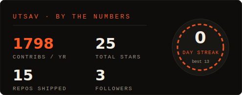
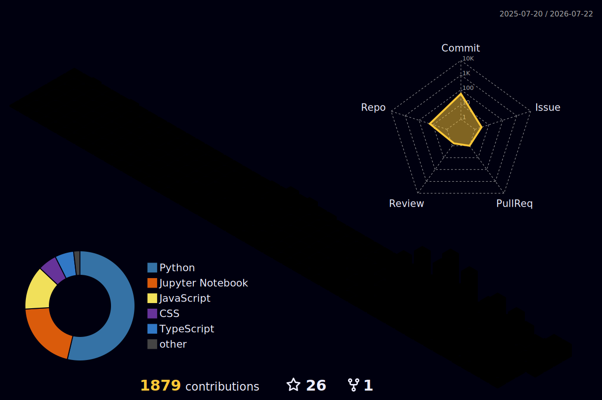

<picture>
  <source media="(prefers-color-scheme: dark)" srcset="assets/hero-dark.svg">
  <source media="(prefers-color-scheme: light)" srcset="assets/hero-light.svg">
  
</picture>

<picture>
  <source media="(prefers-color-scheme: dark)" srcset="https://readme-typing-svg.demolab.com?font=Courier+Prime&weight=700&size=20&duration=2600&pause=900&color=FF5A24&center=true&vCenter=true&width=640&height=40&lines=I+ship+real+products.;23+Play+Store+releases%2C+shipped+solo.;Rs+75L%2B+managed+by+my+software.;3+businesses+run+on+my+builds.;currently+stuck+in+a+TLE.">
  <source media="(prefers-color-scheme: light)" srcset="https://readme-typing-svg.demolab.com?font=Courier+Prime&weight=700&size=20&duration=2600&pause=900&color=CF3E12&center=true&vCenter=true&width=640&height=40&lines=I+ship+real+products.;23+Play+Store+releases%2C+shipped+solo.;Rs+75L%2B+managed+by+my+software.;3+businesses+run+on+my+builds.;currently+stuck+in+a+TLE.">
  
</picture>

 

 

### <samp>01 · selected work</samp>

> **The code is private. The results aren't.** Most of my repos run live businesses with real money in them — they can't be public. So the proof is the kind that matters: numbers, live products, and people who use the software every day.

| | project | what it does | proof |
|---|---|---|---|
| `01` | **Atul Finance** | Investor portal — clients log in and watch their capital and returns live. Managed capital grew from ₹20L to ₹75L+ on top of it. PDF statements, automated comms. | [atulfinance.com ↗](https://www.atulfinance.com) · <samp>CODE PRIVATE</samp> |
| `02` | **JUSTTRADE** | One dashboard over multiple demat accounts — positions, P&L, and strategy-level metrics in a single pane for an active trading desk. | <samp>CODE PRIVATE — REAL MONEY INSIDE</samp> |
| `03` | **ASTRO WALA** | Astrology app for a client — kundli generation and astrologer chat. | <samp>CLIENT WORK</samp> |
| `04` | **GRIT** | Productivity app, 23 versioned releases shipped solo. Push via OneSignal, subscriptions via RevenueCat, Capacitor-wrapped. | [Play Store ↗](https://play.google.com/store/apps/details?id=com.justmanager.app) |
| `05` | **SPLITFREE** | Group expense splitting, built in rebellion against Splitwise's free-tier caps. My flat of five settles rent on it. | <samp>ON THE PLAY STORE · USED DAILY</samp> |

 

### <samp>02 · code you can actually read</samp>

| | |
|---|---|
| [**claude-route**](https://github.com/justutsav/claude-route)  Zero-token model router for Claude Code — a deterministic classifier picks the cheapest capable model per task. Skill + hook + statusline telemetry. <samp>PYTHON</samp> | [**nodepad**](https://github.com/justutsav/nodepad)  A spatial research tool exploring AI that augments thinking instead of replacing it. <samp>TYPESCRIPT</samp> |
| [**wpm-overlay**](https://github.com/justutsav/wpm-overlay)  Real-time words-per-minute overlay with a live graph and color-coded speed indicator. For the Monkeytype habit. <samp>PYTHON · TKINTER</samp> | [**justWhisper**](https://github.com/justutsav/justWhisper)  Local speech-to-text tooling built on Whisper — transcription without sending audio anywhere. <samp>PYTHON</samp> |
| [**Zentry-clone-Website**](https://github.com/justutsav/Zentry-clone-Website)  Award-site rebuild studying scroll choreography and kinetic type. [Live demo ↗](https://zentry-clone-website-mu.vercel.app/) <samp>JAVASCRIPT · GSAP</samp> | [**brain-tumor-highlight**](https://github.com/justutsav/brain-tumor-highlight)  MRI scan analysis experiments — block-based thresholding and visualization with OpenCV. <samp>TYPESCRIPT · CV</samp> |
| [**Rubix-Cube-Project**](https://github.com/justutsav/Rubix-Cube-Project)  Interactive cube — state, rotation math, and rendering from scratch. <samp>TYPESCRIPT</samp> | [**GDrive-Folder-Size-Calculator**](https://github.com/justutsav/GDrive-Folder-Size-Calculator)  The tool Google forgot to build — recursive Drive folder sizes. <samp>PYTHON</samp> |

 

### <samp>03 · live from the workshop</samp>

<!--LIVE:START-->
**⚡ recently pushed**

- [**Avinya_hackathon**](https://github.com/justutsav/Avinya_hackathon) — no description yet · `yesterday`
- [**claude-route**](https://github.com/justutsav/claude-route) — Zero-token model router for Claude Code: deterministic classifier picks the cheapest ca… · `9d ago`
- [**justWhisper**](https://github.com/justutsav/justWhisper) — no description yet · `19d ago`

refreshed 22 Jul 2026, 11:03 IST · by a GitHub Actions cron, no hands involved
<!--LIVE:END-->

 

### <samp>04 · the dashboard</samp>

<!-- self-hosted stat card (assets/card-stats.svg), regenerated daily by the
     cron from live GitHub data — no third-party service to rate-limit or 404 -->

  

<!-- 3d contribution skyline (Actions-generated) also carries the language
     breakdown and commit/PR/issue radar, so no separate cards needed -->
<picture>
  <source media="(prefers-color-scheme: dark)" srcset="profile-3d-contrib/profile-night-rainbow.svg">
  <source media="(prefers-color-scheme: light)" srcset="profile-3d-contrib/profile-season-animate.svg">
  
</picture>

 

  <samp>TS · React · Supabase · Capacitor · Python · pgvector · OpenRouter · RevenueCat · OneSignal</samp>
    
  <samp>building things that should exist — since the gaming-video days.</samp>

